# До оптимизации:

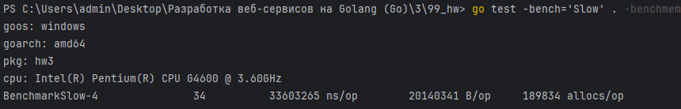

# Профилирование
```shell
# Создание бинарника теста hw3.test.exe, 
# снятие профиля для CPU cpu.out,
# профиля для памяти mem.out с флагом -memprofilerate=1 (учитывать каждую аллокацию)
go test -bench='Slow' . -v -benchmem -cpuprofile='cpu.out' -memprofile='mem.out' -memprofilerate=1
```

```shell
# Просмотр результатов по процессору в web-интерфейсе
go tool pprof -http=:8080 .\hw3.test.exe .\cpu.out
```

```shell
# Просмотр результатов по памяти в web-интерфейсе
go tool pprof -http=:8080 .\hw3.test.exe .\mem.out
```
## CPU

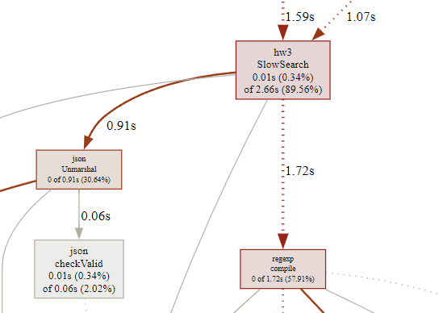

Основные издержки приходятся на `json.Unmarshal` и `regexp.Compile`.

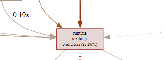

Из-за них происходит большое количество аллокаций, занимающих процессорное время.

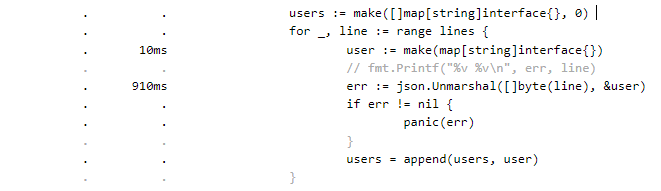

Суммарно уходит почти секунда времени на `json.Unmarshal`.

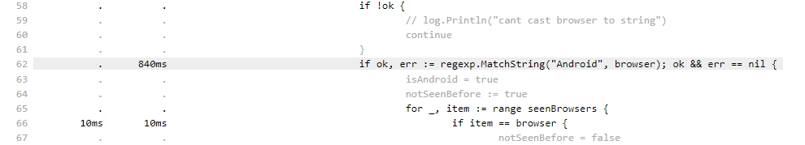

Почти секунда на `regexp.MatchString`.

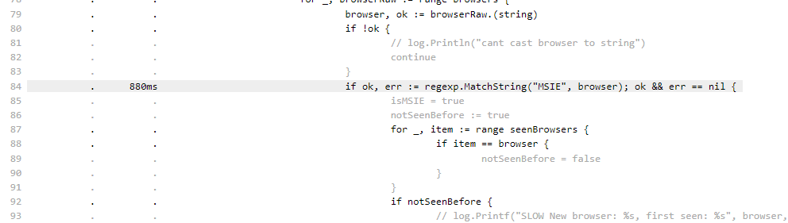

Еще раз почти секунда на `regexp.MatchString` спустя несколько строчек.

## Memory

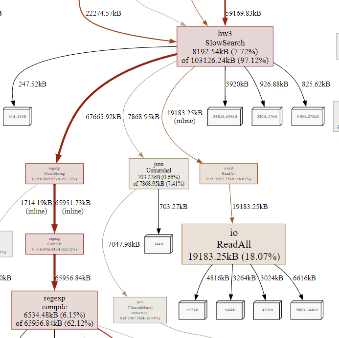

Самые большие издержки по памяти приходятся на `regexp.MatchString`, `json.Unmarshal` и `ioutil.ReadAll`.

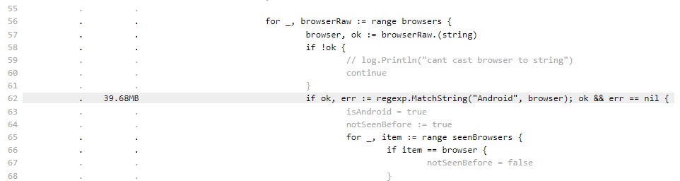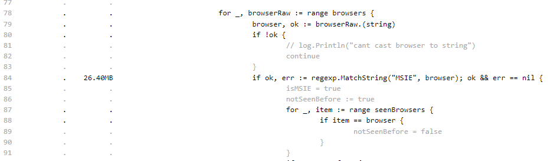

Для выполнения `regexp.MatchString` требуется 40 и 26 МБ памяти.

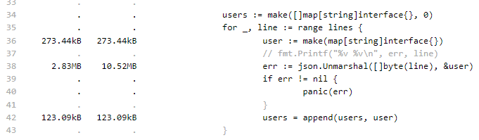

На `json.Unmarshal` 10 МБ.

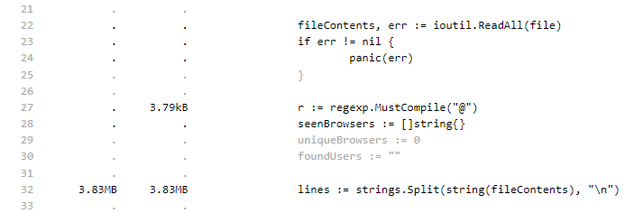

На чтение всего файла целиком и последующее разделение на строки 4 МБ.

## Резюме

1. Самой большой проблемой, как по памяти, так и по процессору являются regexp'ы (MatchString). В сущности происходит проверка, что в строке `browser` находится подстрока `"Android"` или `"MSIE"` соответственно. При этом происходят аллокации памяти, и тратится процессорное время. Можно прекомпилировать структуру для регулярного выражения, чтобы не делать это каждый раз в цикле. Но поскольку паттерн для регулярного выражения простой, можно заменить его на `strings.Contains`, который гораздо лучше:

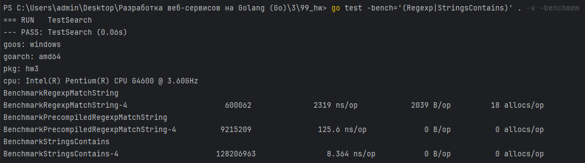

После исправления получили следующие результаты: 

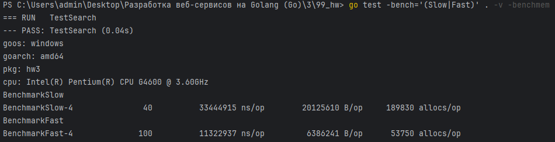

2. Следующей проблемой является `json.Unmarshal`, как по памяти, так и по процессору. Там происходит приведение к `map[string]interface{}`, из-за чего нужно будет приводить каждый интерфейс к конкретному типу. Бенчмарк показал, что `json.Unmarshal` в структуру работает лучше: 

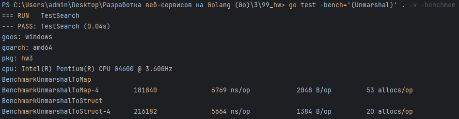

`json.Unmarshal` в структуру работает быстрее, требует меньше аллокаций и памяти.

После исправления в коде: 

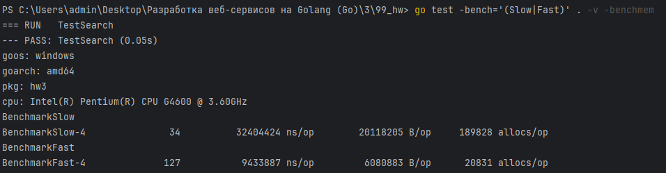

3. Использование другого Unmarshaler'а, использующего кодогенерацию, в данном случае `github.com/mailru/easyjson` улучшает работоспособность еще больше:

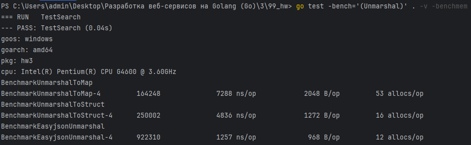

После исправления в коде: 

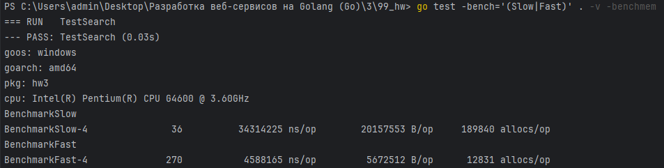