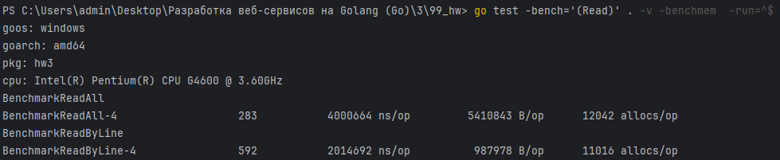
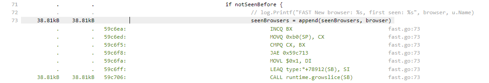

# До оптимизации:


# Профилирование
```shell
# Создание бинарника теста hw3.test.exe, 
# снятие профиля для CPU cpu.out,
# профиля для памяти mem.out с флагом -memprofilerate=1 (учитывать каждую аллокацию)
go test -bench='Slow' . -v -benchmem -cpuprofile='cpu.out' -memprofile='mem.out' -memprofilerate=1
```

```shell
# Просмотр результатов по процессору в web-интерфейсе
go tool pprof -http=:8080 .\hw3.test.exe .\cpu.out
```

```shell
# Просмотр результатов по памяти в web-интерфейсе
go tool pprof -http=:8080 .\hw3.test.exe .\mem.out
```
## CPU


Основные издержки приходятся на `json.Unmarshal` и `regexp.Compile`.


Из-за них происходит большое количество аллокаций, занимающих процессорное время.


Суммарно уходит почти секунда времени на `json.Unmarshal`.


Почти секунда на `regexp.MatchString`.


Еще раз почти секунда на `regexp.MatchString` спустя несколько строчек.

## Memory


Самые большие издержки по памяти приходятся на `regexp.MatchString`, `json.Unmarshal` и `ioutil.ReadAll`.


Для выполнения `regexp.MatchString` требуется 40 и 26 МБ памяти.


На `json.Unmarshal` 10 МБ.


На чтение всего файла целиком и последующее разделение на строки 4 МБ.

# Резюме

1. Самой большой проблемой, как по памяти, так и по процессору являются regexp'ы (MatchString). В сущности происходит проверка, что в строке `browser` находится подстрока `"Android"` или `"MSIE"` соответственно. При этом происходят аллокации памяти, и тратится процессорное время. Можно прекомпилировать структуру для регулярного выражения, чтобы не делать это каждый раз в цикле. Но поскольку паттерн для регулярного выражения простой, можно заменить его на `strings.Contains`, который гораздо лучше:


После исправления получили следующие результаты: 


2. Следующей проблемой является `json.Unmarshal`, как по памяти, так и по процессору. Там происходит приведение к `map[string]interface{}`, из-за чего нужно будет приводить каждый интерфейс к конкретному типу. Бенчмарк показал, что `json.Unmarshal` в структуру работает лучше: 


`json.Unmarshal` в структуру работает быстрее, требует меньше аллокаций и памяти.

После исправления в коде: 


3. Использование другого Unmarshaler'а, использующего кодогенерацию, в данном случае `github.com/mailru/easyjson` улучшает работоспособность еще больше:


После исправления в коде: 


4. Вместо того чтобы целиком читать файл с помощью `ioutil.ReadAll`, можно попробовать читать его построчно и сразу обрабатывать. Таким образом не будет необходимости постоянно держать в памяти огромное количество данных. Плюс нам в действительности не нужно иметь массив строк - нам нужен массив массивов байт для десериализации пользователя.



Бенчмарк показывает, что это вдвое быстрее, и требует в 5 раз меньше памяти на операцию.

После исправления в коде:


# Профилирование после оптимизаций выше

## CPU


Самый большой упор идет на десериализацию данных, которую мы уже оптимизировали, и это занимает 80% времени процессора. 5% на чтение, и остальные 5% еще на регулярные выражения и на Sprintf. Возможно последние 5% можно улучшить.


## Memory


Регулярное выражение занимает память.


Происходит рост слайса пользователей.




Происходит рост слайса посещенных браузеров.


Требуется память для конкатенации строк foundUsers.

# Резюме 2

1. Слайс пользователей нам нужен только для того, чтобы по нему итерироваться. Тогда сам слайс нам не нужен, ведь можно использовать пользователя сразу, как мы его получили, не накапливая.


B/op уменьшилось на треть.

2. Вместо конкатенации строк `foundUsers` лучше использовать stringBuilder, т.к. при каждой конкатенации происходит выделение памяти под новую строку, содержащую старую + присоединяемую.


B/op уменьшилось еще на 20%.

3. В коде дважды проходят по одной и той же коллекции. Эти циклы можно объединить. Внутри каждого цикла проверяется, был ли какой-то браузер в слайсе `seenBrowsers`. Для этих целей лучше использовать мапу. 


Немного уменьшилось ns/op.

4. Для замены подстроки в строке лучше использовать `strings.ReplaceAll` вместо регулярного выражения:


Уменьшились B/op и allocs/op.