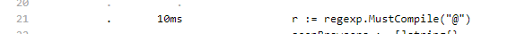

# CPU 

1. 

    regexp.compile, занимает 61% от всей работы

2. 

    Большое количество аллокаций, в т.ч. от regexp    

3. 

    Анмаршалинг занимает 26% от всей работы

4. 

    Анмаршалинг в коде

5. 
    
    Создание регекспа в коде

6. 

    Создание второго регекспа в коде

7. 

    Стоит ли использовать регексп, если можно использовать строки?

8. 

    Нужно ли читать весь файл целиком?

# Memory

1. 

    Проверка соответствия строке занимает 66% памяти

2. 
    
    Чтение целиком занимает 16% памяти

3. 

    На операции с регексп и чтение всего файла приходится 65% памяти

4. 

    26.60 МБ на чтение файла целиком

5. 

    Перевод контента к строке и разделение по \n. Мб лучше просто читать построчно? Мб можно узнать сразу сколько строк, и предаллоцировать место под строки. 

6. 

    Анмаршалинг

7. 

    Создание регекспа

8. 

    Создание регекспа 2

9.  

    Можно ли что-то сделать с Sprintf? Мы постоянно конкатенируем => можно использовать стрингбилдер. Для замены 1 символа на строка можно использовать не регексп?

# Оптимизации

1. При помощи go test -bench . -benchmem и бенчмарков BenchmarkRegexpReplaceString, BenchmarkStringsReplaceString увидели, что для замены лучше использовать строки вместо регекспа

     

2. `regexp.MatchString("Android", browser)` и `regexp.MatchString("MSIE", browser)` по сути проверяют, что в browser содержится строка "Android", но при этом каждый раз внутри себя создает структуру для парсинга регекспа. Лучше использовать strings.Contains:

    

3. Вместо считывания файла целиком и хождения по каждой строчке, будем читать построчно и сразу обрабатывать, создавая юзеров. 

    

4. Вместо того чтобы заполнять отдельно юзеров, а потом по них проходиться, будем сразу обрабатывать юзера, как создали его.

5. Происходит проход по слайсу браузеров дважды, можно сделать это единожды:

    

6. Переменная uniqueBrowsers не используется

    

# Промежуточные результаты

## После оптимизаций 1 и 2

## После оптимизации 3

## После оптимизации 4

## После оптимизации 5

